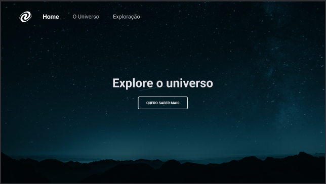

<h1 align="center"> SPA Universe </h1>

<p align="center">
  <a href="#Introducao"> 🧩 Introdução </a>&nbsp;&nbsp;&nbsp;|&nbsp;&nbsp;&nbsp;
  <a href="#Dependencias"> 🧪 Dependências</a>&nbsp;&nbsp;&nbsp;|&nbsp;&nbsp;&nbsp;
  <a href="#Aplicacao"> 🚀 Aplicação</a>&nbsp;&nbsp;&nbsp;|&nbsp;&nbsp;&nbsp;
  <a href="#Licensa"> 📝 License</a>&nbsp;&nbsp;&nbsp;&nbsp;&nbsp;&nbsp;
</p>

<a id="Introducao"></a>
## 🧩 Introdução

### Criação de uma projeto simples para o estudo de desenvolvimento de SPA (Single Page Aplication) feita em HTML, CSS e JavaScript.

<a href="https://www.figma.com/file/GmKabBzjjhdk1mMZIFXvj5/%5BDesafios-Explorer%5D-SPA-Universe-(Copy)?type=design&node-id=104-48&mode=design&t=OxjuN2jgoeJ5rUHO-0">Design no Figma</a>

<div align="center">
  
</div>

### O que foi abordado nesse desafio:

- Conceitos de SPA;
- Mapeamento de rotas;
- Assíncronismo e promises;
- Orientação a objetos;
- Classes e muito mais.

<a id="Dependencias"></a>
## 🧪 Dependencias
> Requisitos para rotar o código.

- [JavaScript](https://developer.mozilla.org/pt-BR/docs/Web/JavaScript)
- [HTML](https://developer.mozilla.org/pt-BR/docs/Web/HTML)
- [CSS](https://developer.mozilla.org/pt-BR/docs/Web/CSS)
- [Lite Server](https://www.npmjs.com/package/lite-server)

<a id="Aplicacao"></a>
## 🚀 Aplicação

### Instalação e inicialização do projeto

### ```COMANDOS```

#### Para instalar as dependências
```
 npm install
```

#### Para rodar o projeto
```
 npm start
```
<a id="Licensa"></a>
## 📝 License

Este projeto possui uma Licença MIT License - veja o arquivo [LICENSE](./LICENSE) para mais detalhes.

<div align="center">
  Made with ❤️ by Davi Teixeira
</div>
